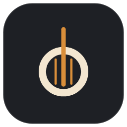

<div align="center">



# Kora ADE

**Seus projetos, seus agentes, cada conversa no lugar certo.**

Ambiente de desenvolvimento para trabalhar com agentes de IA — Claude Code e Codex — organizado por projeto,
com cada aba de terminal presa à sua conversa.

[Site](https://kora-ade.vercel.app/) · [Baixar](https://github.com/EduardoAndradeMachado/kora-ade/releases/latest) · Beta · Windows 10/11

</div>

---

## Por que existe

Quem trabalha com vários projetos e vários agentes ao mesmo tempo acaba com uma pilha de terminais sem nome
e sem saber qual conversa estava em qual. O Kora organiza isso: cada projeto tem as suas abas, cada aba sabe
qual sessão do Claude ou do Codex está rodando nela, e fechar o computador não perde nada — na próxima abertura,
**Continuar chat** retoma exatamente aquela conversa.

## O que ele faz

- **Projetos na lateral**, em categorias e subcategorias que você cria (por empresa, cliente, fase…), com uma
  seção **Ocultos** para o que não está em uso — dá para ocultar um projeto ou uma categoria inteira.
- **Abas de terminal por projeto.** Abas do Claude e do Codex ficam ligadas à sessão, sem configurar nada:
  o Kora lê o que os próprios agentes já gravam no disco.
- **Sessões da pasta:** a lista de conversas do Claude e do Codex daquele projeto, para abrir, fixar como aba ou apagar.
- **Arquivos:** explorador com as cores do git, que acompanha o que os agentes criam e movem; editor de código,
  Markdown com visualização, PDF e imagem em aba; arrastar para mover e renomear com F2.
- **Git:** branch atual, locais, remotas e worktrees; criar e trocar branch; iniciar repositório e vincular ao GitHub.
- **Terminal feito para agentes:** colar um print com Ctrl+V vira o caminho do arquivo; arrastar um arquivo do
  explorador cola o caminho; Ctrl+clique em `src/app.ts:42` abre o arquivo na linha.
- **Limites de uso** do Claude e do Codex (janela de 5 h, semanal e horário do reset) no rodapé.
- Tema claro e escuro, zoom da interface e do texto do terminal separados, fecha para a bandeja e se atualiza sozinho.

## Instalação

1. Baixe o `Kora-ADE-Setup-<versão>.exe` em [Releases](https://github.com/EduardoAndradeMachado/kora-ade/releases/latest).
2. Execute. A instalação é só para o seu usuário e não pede administrador.
3. O instalador ainda não tem assinatura digital, então o Windows avisa **Editor desconhecido**:
   clique em **Mais informações → Executar assim mesmo**.

**Atualizações:** o Kora procura versões novas sozinho. Quando uma estiver baixada, aparece **Atualizar agora**
na lateral; um clique fecha o app, instala e abre de novo. Projetos, categorias e abas continuam onde estavam.

### Requisitos

- Windows 10 ou 11, 64 bits.
- [Claude Code](https://docs.anthropic.com/claude-code) e/ou [Codex CLI](https://github.com/openai/codex) instalados
  e no PATH. O Kora abre os agentes que você já usa — ele não traz nenhum agente próprio.
- Git, se quiser o painel Git.

## Privacidade

- Sem telemetria e sem servidor próprio: o Kora não coleta nem envia dados de uso. Ele só acessa a rede para o limite de uso do Claude, o ícone do projeto e as atualizações, descritos abaixo.
- Para achar sessões e títulos de conversas, lê as pastas `~/.claude` e `~/.codex` do seu usuário.
- Para mostrar o limite de uso do Claude, lê o login do Claude Code (`~/.claude/.credentials.json`) e envia o token
  **somente** para `api.anthropic.com` — o mesmo endereço que o `/usage` do Claude Code consulta —, no máximo uma vez
  a cada 5 minutos. O uso do Codex vem de arquivos locais.
- Para o ícone de um projeto que não tem logo na pasta, baixa o avatar do dono do repositório no GitHub
  (`github.com/<dono>.png`, a partir do remote do git) e guarda em cache até você pedir **Atualizar ícone**.
- Para se atualizar, consulta as Releases deste repositório no GitHub.
- Os dados do app (projetos, categorias, abas) ficam em `%APPDATA%\Kora ADE`. Desinstalar não apaga essa pasta.

## Atalhos

| Atalho | O que faz |
| --- | --- |
| `Ctrl+W` | Fecha a aba atual (terminal rodando pede confirmação) |
| `F2` | Renomeia a aba atual ou o item selecionado no explorador |
| `Ctrl+S` | Salva o arquivo aberto no editor |
| `Ctrl +` / `Ctrl −` / `Ctrl 0` | Zoom da interface |
| `Ctrl Shift +` / `−` / `0` ou `Ctrl` + roda | Tamanho do texto do terminal |
| `Ctrl+V` com um print copiado | Cola no terminal o caminho da imagem |
| `Ctrl` + clique num caminho | Abre o arquivo no editor, na linha indicada |

## Desenvolvimento

Precisa de Node.js 22 e [pnpm](https://pnpm.io).

```bash
pnpm install
pnpm dev      # app em modo de desenvolvimento (dados em %APPDATA%\Kora ADE Dev, separados do app instalado)
pnpm check    # tipos, lint e testes unitários
pnpm e2e      # testes de ponta a ponta com Claude e Codex falsos (abre janelas do app)
pnpm dist     # gera o instalador em dist/
```

Feito com Electron, React, TypeScript, xterm.js, node-pty e Monaco.

## Estado do projeto

Beta: funciona no dia a dia, mas ainda muda e pode ter falhas. Encontrou um problema? Abra uma
[issue](https://github.com/EduardoAndradeMachado/kora-ade/issues).

## Licença

Código disponível sob a [PolyForm Internal Use 1.0.0](LICENSE), com permissão adicional para uso pessoal.

- **Pode:** baixar, instalar, clonar, compilar e modificar o Kora para uso pessoal ou dentro da sua empresa.
- **Não pode:** distribuir o Kora, original ou modificado, nem vender ou publicar uma versão sua dele.

---

Kora ADE é um projeto independente, sem vínculo com a Anthropic ou a OpenAI. Claude, Claude Code e Codex são marcas
dos seus respectivos donos; os ícones aparecem só para identificar qual agente roda em cada aba.
